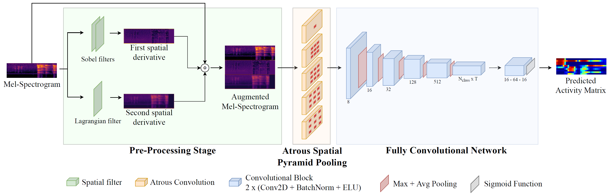

The objective of a sound event detector is to recognize anomalies in an audio clip and return their onset and offset. However, detecting sound events in noisy environments is a challenging task. This is due to the fact that in a real audio signal several sound sources co-exist. Moreover, the characteristics of polyphonic audios are different from isolated recordings. It is also necessary to consider the presence of noise (e.g. thermal and environmental). In this contribution, we present a sound anomaly detection system based on a fully convolutional network which exploits image spatial filtering and an Atrous Spatial Pyramid Pooling module. To cope with the lack of datasets specifically designed for sound event detection, a dataset for the specific application of noisy bus environments has been designed. The dataset has been obtained by mixing background audio files, recorded in a real environment, with anomalous events extracted from monophonic collections of labelled audios. The performances of the proposed system have been evaluated through segment-based metrics such as error rate, recall, and F1-Score. Moreover, robustness and precision have been evaluated through four different tests. The analysis of the results shows that the proposed sound event detector outperforms both state-of-the-art methods and general purpose deep learning-solutions.