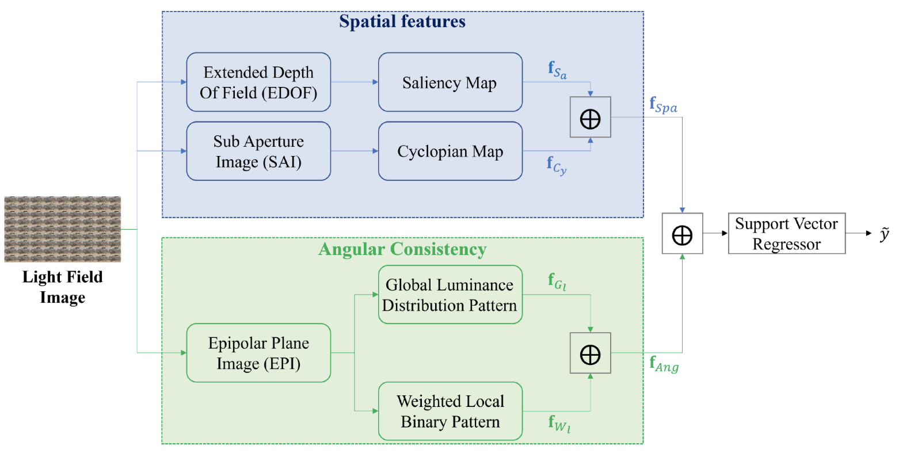

In the near future, the broadcasting scenario will be characterized by immersive content. One of the systems for capturing the 3D content of a scene is the Light Field imaging. The huge amount of data and the specific transmission scenario impose strong constraints on services and applications. Among others, the evaluation of the quality of the received media cannot rely on the original signal but should be based only on the received data. In this direction, we propose a no-reference quality metric for light field images which is based on spatial and angular characteristics. In more details, the estimated saliency and cyclopean maps of light field images are exploited to extract the spatial features. The angular consistency features are, instead, measured with the use of the Global Luminance Distribution knowledge and the Weighted Local Binary Patterns operator on Epipolar Plane Images. The effectiveness of the proposed metric is assessed by comparing its performance with state-of-the-art quality metrics using 4 datasets: SMART, Win5-LID, VALID 10-bit, and VALID 8-bit. Furthermore, the performance is analyzed in cross-datasets, with different distortions, and for different saliency maps. The achieved results show that the performance of the proposed model outperforms state-of-the-art approaches and perform well for different distortion types and with various saliency models.