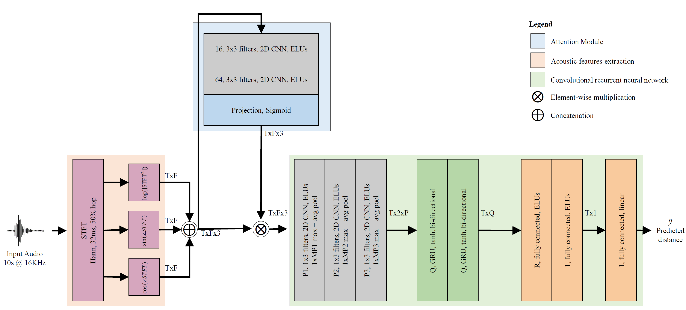

Distance estimation from audio plays a crucial role in various applications, such as acoustic scene analysis, sound source localization, and room modeling. Most studies predominantly center on employing a classification approach, where distances are discretized into distinct categories, enabling smoother model training and achieving higher accuracy but imposing restrictions on the precision of the obtained sound source position. Towards this direction, in this paper we propose a novel approach for continuous distance estimation from audio signals using a convolutional recurrent neural network with an attention module. The attention mechanism enables the model to focus on relevant temporal and spectral features, enhancing its ability to capture fine-grained distance-related information. To evaluate the effectiveness of our proposed method, we conduct extensive experiments using audio recordings in controlled environments with three levels of realism (synthetic room impulse response, measured response with convolved speech, and real recordings) on four datasets (our synthetic dataset, QMULTIMIT, VoiceHome-2, and STARSS23). Experimental results show that the model achieves an absolute error of 0.11 meters in a noiseless synthetic scenario. Moreover, the results showed an absolute error of about 1.30 meters in the hybrid scenario. The algorithm's performance in the real scenario, where unpredictable environmental factors and noise are prevalent, yields an absolute error of approximately 0.50 meters.