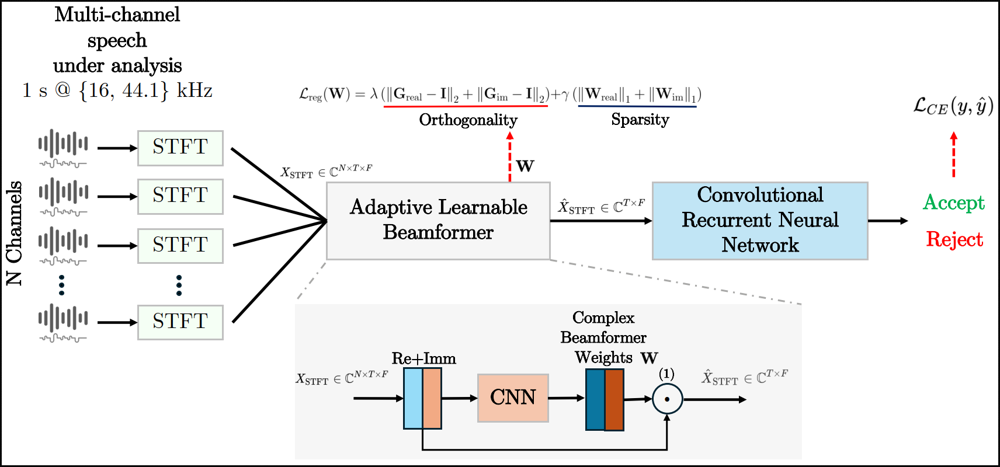

Replay attacks belong to the class of severe threats against voice-controlled systems, exploiting the easy accessibility of speech signals by recorded and replayed speech to grant unauthorized access to sensitive data. In this work, we propose a multi-channel neural network architecture called M-ALRAD for the detection of replay attacks based on spatial audio features. This approach integrates a learnable adaptive beamformer with a convolutional recurrent neural network, allowing for joint optimization of spatial filtering and classification. Experiments have been carried out on the ReMASC dataset, which is a state-of-the-art multi-channel replay speech detection dataset encompassing four microphones with diverse array configurations and four environments. Results on the ReMASC dataset show the superiority of the approach compared to the state-of-the-art and yield substantial improvements for challenging acoustic environments. In addition, we demonstrate that our approach is able to better generalize to unseen environments with respect to prior studies.